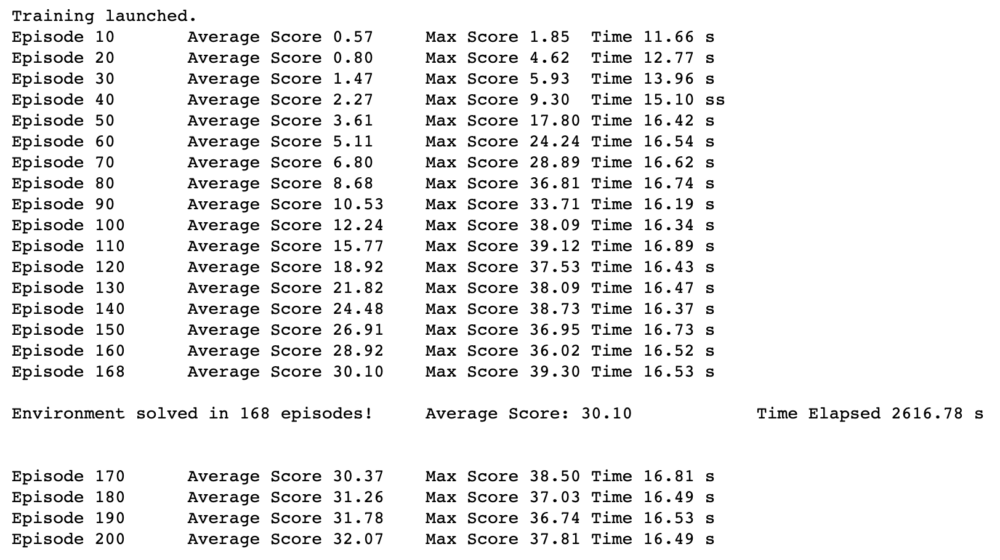
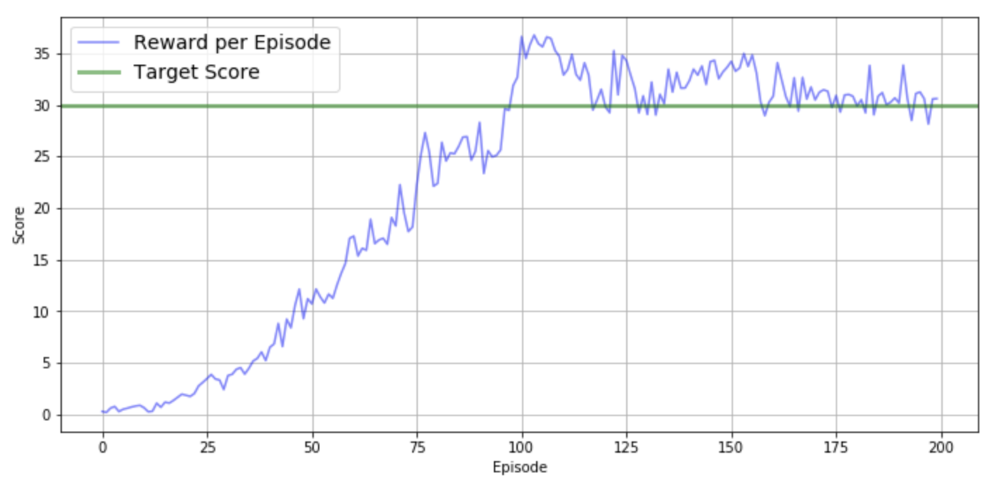

# Introduction

In order to solve the environment, our agent must achieve a score of +30 averaged across all 20 agents for 100 consecutive episodes.

## Global architecture

- First, I needed to determine how many "brains" were controlling the agents.

The version of the environment I've chosen has 20 different arms, whereas the Navigation project had only a single agent. To keep things simple, I decided to use a single brain to control all 20 agents for temporal and technical simplicity.

- I also needed to pick which algorithms were the most suitable for the Reacher environment.

The action space is continuous, which allows each agent to execute more complex actions, whilst the agent in the first project was limited to 4 discrete actions.
Given this parameter, the value-based (Deep Q-Network) method I used for the last project would not work as well. That's why I needed to use policy-based methods.

## DDPG

In [Continuous Control with Deep Reinforcement Learning](https://arxiv.org/pdf/1509.02971.pdf), written by researchers at Google DeepMind, they highlight that Deep Deterministic Policy Gradient (DDPG) can be seen as an extension of Deep Q-learning to continuous tasks. That's why I picked this "Actor-Critic" algorithm.

With a policy-based approach, the Actor learns how to act by directly estimating the optimal policy and maximizing reward through gradient ascent, while the Critic learns how to estimate the value of different state-action pairs with a value-based approach.

## Local and target networks 

Moreover, I used local and target networks to improve stability.

## Ornstein-Uhlenbeck

I've also used the Ornstein-Uhlenbeck process (as suggested in the previously mentioned paper by Google DeepMind), which adds a certain amount of noise to the action values at each timestep and therefore allows the arm to maintain velocity and explore the action space.

## Gradient clipping

Finally, after many failed trainings, I've decided to use gradient clipping, implemented in `Agent.learn()`, within `ddpg_agent.py`. This method sets a limit on the size of the parameter updates, and stops them from growing too fast.

# Hyperparameters

## Networks

In `model.py`, you can find the (almost similar) architectures of the Actor and the Critic :
- input_size = state_size = 33
- 2 hidden fully-connected layers with 400 and 300 nodes
- ReLu activation function was used between fc1 and fc2
- A Batch Normalization was used between the output of fc1 and its activation

## Agent's hyperparameters

Many tests were run but the final choice of the hyperparameters was :

- `BUFFER_SIZE` = int(1e6) : replay buffer size
- `BATCH_SIZE` = 128 : minibatch size
- `GAMMA` = 0.99 : discount factor
- `TAU` = 1e-3 : for soft update of target parameters
- `LR` = 5e-4 : learning rate
- `LR_ACTOR` = 1e-3         # learning rate of the actor
- `LR_CRITIC` = 1e-3        # learning rate of the critic
- `WEIGHT_DECAY` = 0        # L2 weight decay
- `EPSILON = 1.0`           # explore->exploit for Ornstein-Uhlenbeck process
- `EPSILON_DECAY = 1e-6`    # decay rate for noise process

# Results

The agent reached its goal (moving average >= 30 over 100 consecutive episodes) after 168 episodes.
The training details are shown below.

